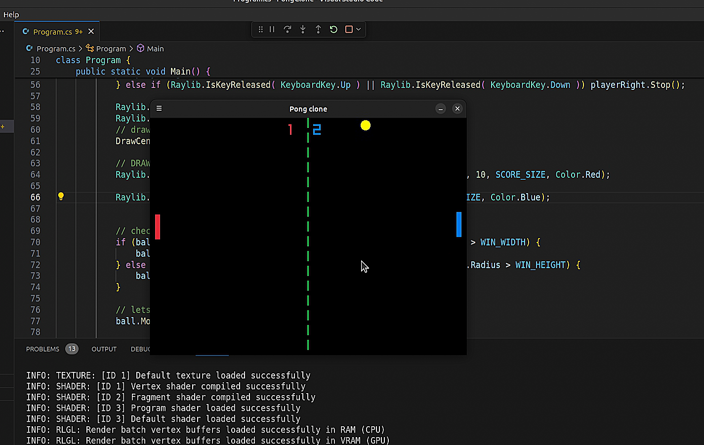

# Pong clone with C# & Raylib

This is simple Pong game clone in C# using Raylib C# bindings [Raylib-cs](https://github.com/chrisdill/raylib-cs)

# [Check Youtube Video tutorial](https://www.youtube.com/watch?v=YaqiR93tI3o&list=PL5XiDviwujocJGvpu-cwy6kkOJKay8Qig)

